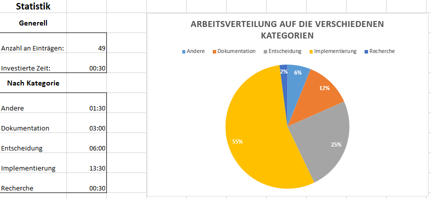
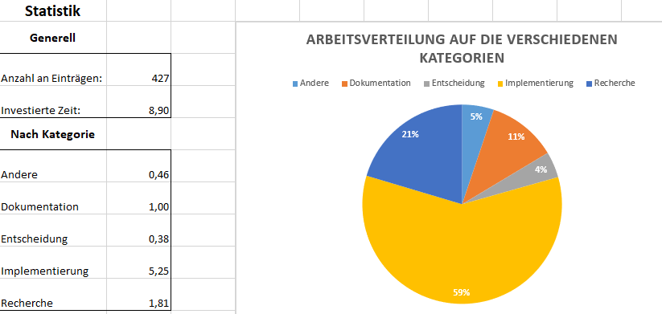

# Was erfassen wir

Wir erfassen die Zeiten in folgenden Kategorien:
* Implementierung
* Recherche
* Dokumentation
* Entscheidung
* Andere

Dadurch können wir später den Anteil an der insgesamt verwendeten Zeit bestimmen und während des Projektes feststellen, welche Bereiche sehr viel Zeit benötigen.

# Wie erfassen wir

Wir erfassen für jeden Eintrag den Zeitblock, die Kategorie und eine kurze Beschreibung der Tätigkeit und wenn nötig eine Referenz.

Ein Zeitblock entspricht 30 Minuten, da 30 Minuten in jeder der gewählten Kategorien den minimalen Arbeitsaufwand beschreiben. Basierend auf unserer bisherigen Erfahrung gehen wir davon aus, dass man sich mindestens 30 Minuten mit einem Thema beschäftigen muss, um produktiv arbeiten zu können.

# Time-Tracking

Um die aufgewendete Zeit zu erfassen verwenden wir das bereitgestellte Excel Template.

Dieses ist für alle Teammitglieder verfügbar in der Sciebo Campus Cloud gespeichert und unter 
[Team 3 Diary](https://th-koeln.sciebo.de/apps/onlyoffice/370822622?filePath=%2FFAE%2Fdiary_team_3.xlsx) 
für die Teammitglieder verfügbar.

Jeglichen zeitlichen Aufwand, der mit dem FAE Projekt im Zusammenhabg steht werden wir dort erfassen.

## Beispielauswertung

Beispiel der Auswertung aus unserer Time-Tracking Datei bis zum 29.11.2019.

Beispiel der Auswertung aus unserer Time-Tracking Datei bis zum 31.01.2020.